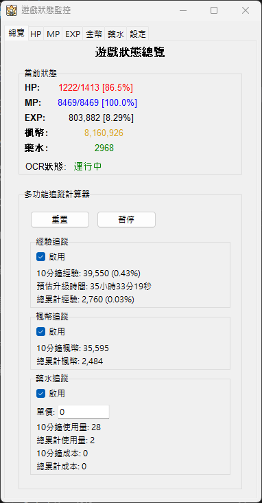

# MapleStory 遊戲狀態監控程式使用說明

## 🎮 程式介紹

這是一個專為 MapleStory 遊戲設計的狀態監控程式，可以自動識別並監控遊戲中的：
- **HP（生命值）**：顯示當前生命值和最大生命值
- **MP（魔法值）**：顯示當前魔法值和最大魔法值  
- **EXP（經驗值）**：顯示當前經驗值百分比，並計算升級所需時間
- **金幣**：監控當前金幣數量
- **藥水**：追蹤藥水使用情況


程式使用光學字元識別(OCR)技術，透過擷取遊戲畫面特定區域來自動讀取數值，不會被當作非法程式。

**✨ 主要特色**：
- 🎯 自動視窗識別和區域選擇
- 📊 即時數值監控和歷史追蹤
- ⚙️ 自訂透明度和視窗釘選功能
- 🎨 直觀的使用者介面設計
- 💾 自動配置儲存和載入

**截圖**：檢視程式執行時的實際效果




---

## 📋 目錄

1. [系統需求](#系統需求)
2. [Python 安裝教學](#python-安裝教學)
3. [程式下載與安裝](#程式下載與安裝)
4. [第一次使用設定](#第一次使用設定)
5. [如何使用程式](#如何使用程式)
6. [常見問題解決](#常見問題解決)
7. [進階設定](#進階設定)

---

## 💻 系統需求

### Windows 使用者
- **作業系統**：Windows 10 或更新版本
- **記憶體**：至少 4GB RAM
- **硬碟空間**：至少 1GB 可用空間
- **網路連線**：首次安裝時需要網路下載套件

### Mac 使用者
- **作業系統**：macOS 10.15 (Catalina) 或更新版本
- **記憶體**：至少 4GB RAM
- **硬碟空間**：至少 1GB 可用空間
- **網路連線**：首次安裝時需要網路下載套件
- **許可權**：可能需要允許應用程式擷取螢幕畫面

---

## 🐍 Python 安裝教學

### 共通步驟：下載 Python

1. 開啟瀏覽器（Chrome、Firefox、Safari、Edge 等）
2. 前往 Python 官方網站：https://www.python.org/downloads/
3. 點選黃色的 "Download Python 3.x.x" 按鈕（x 代表版本號碼）
4. 等待下載完成

---

### Windows 使用者安裝步驟

#### 步驟 1：找到下載的檔案
- 通常在「下載」資料夾中
- 檔案名稱類似 `python-3.x.x-amd64.exe`

#### 步驟 2：開始安裝
1. **雙擊下載的檔案**
   - 如果出現安全提示，點選「是」或「執行」

2. **重要設定**
   - ✅ **必須勾選** "Add Python to PATH" 
   - ✅ **必須勾選** "Install for all users"（如果有此選項）
   - 點選 "Install Now"

3. **等待安裝完成**
   - 安裝過程約需 3-5 分鐘
   - 看到 "Setup was successful" 表示安裝成功

#### 步驟 3：驗證安裝（Windows）
1. **開啟命令提示字元**
   - 按下 `Windows鍵 + R`
   - 輸入 `cmd` 後按 Enter
   - 會開啟黑色視窗

2. **檢查 Python 版本**
   - 在黑色視窗中輸入：`python --version`
   - 按 Enter
   - 如果顯示 `Python 3.x.x` 表示安裝成功

3. **檢查 pip 工具**
   - 輸入：`pip --version`
   - 按 Enter
   - 如果顯示版本資訊表示正常

---

### Mac 使用者安裝步驟

#### 步驟 1：找到下載的檔案
- 通常在「下載專案」資料夾中
- 檔案名稱類似 `python-3.x.x-macos11.pkg`

#### 步驟 2：開始安裝
1. **雙擊下載的 .pkg 檔案**
   - 可能會顯示「無法開啟，因為它來自未識別的開發者」
   - 如果出現此問題：
     - 右鍵點選檔案 → 選擇「開啟」
     - 在彈出視窗中點選「開啟」

2. **按照安裝精靈進行**
   - 點選「繼續」
   - 閱讀授權條款，點選「同意」
   - 選擇安裝位置（建議使用預設位置）
   - 點選「安裝」

3. **輸入管理員密碼**
   - 系統會要求輸入您的 Mac 登入密碼
   - 輸入密碼後點選「安裝軟體」

4. **等待安裝完成**
   - 安裝過程約需 3-5 分鐘
   - 看到「安裝成功」表示完成

#### 步驟 3：驗證安裝（Mac）
1. **開啟終端機**
   - 方法一：按下 `Command + 空白鍵`，輸入「終端機」或「Terminal」，按 Enter
   - 方法二：開啟「應用程式」→「工具程式」→「終端機」

2. **檢查 Python 版本**
   - 在終端機中輸入：`python3 --version`
   - 按 Enter
   - 如果顯示 `Python 3.x.x` 表示安裝成功

3. **檢查 pip 工具**
   - 輸入：`pip3 --version`
   - 按 Enter
   - 如果顯示版本資訊表示正常

4. **設定別名（可選，讓指令更簡單）**
   - 輸入：`echo 'alias python=python3' >> ~/.zshrc`
   - 輸入：`echo 'alias pip=pip3' >> ~/.zshrc`
   - 輸入：`source ~/.zshrc`
   - 之後就可以使用 `python` 和 `pip` 指令

---

## 📦 程式下載與安裝

### 🚀 自動安裝（推薦）

#### Windows 使用者

1. **下載程式檔案**
   - 下載完整的程式資料夾
   - 解壓縮到您想要的位置（如桌面）

2. **執行自動安裝**
   - 雙擊 `install.bat` 檔案
   - 或右鍵選擇「以系統管理員身分執行」
   - 按照螢幕指示完成安裝

3. **啟動程式**
   - 安裝完成後，雙擊 `run` 啟動程式

#### Mac 使用者

1. **下載程式檔案**
   - 下載完整的程式資料夾
   - 解壓縮到您想要的位置（如桌面）

2. **執行自動安裝**
   - 開啟終端機（按 `Command + 空白鍵`，輸入「終端機」或「Terminal」）
   - 切換到程式資料夾：
     ```bash
     cd ~/Desktop/MapleStoryMonitor
     ```
     （如果程式不在桌面，請調整路徑）
   - 給予安裝指令碼執行許可權並執行：
     ```bash
     chmod +x install.sh
     ./install.sh
     ```
   - 按照螢幕指示完成安裝
   - 安裝過程中如果遇到選擇，建議選擇「1. 重新安裝」

3. **啟動程式**
   - 安裝完成後，可以用以下任一方式啟動：
     - **終端機啟動**：在程式資料夾中執行 `./run.command`
     - **雙擊啟動**：雙擊 `run.command` 檔案（程式啟動後可關閉終端機視窗）

4. **重要許可權設定（首次啟動時可能需要）**
   - macOS 可能會要求「輔助使用」許可權來擷取螢幕
   - 如果程式無法正常工作，請前往：
     - 「系統偏好設定」→「安全性與隱私」→「隱私權」
     - 選擇「輔助使用」或「螢幕錄製」
     - 將 Python 或終端機新增到允許清單中

---

### 📁 手動安裝（進階使用者）

#### 方法一：下載 ZIP 檔案（建議新手使用）

1. **下載程式檔案**
   - 聯絡程式提供者獲取最新版本的 ZIP 檔案
   - 或從指定位置下載 `MapleStoryMonitor.zip`

2. **解壓縮檔案**
   - 在下載的 ZIP 檔案上按右鍵
   - 選擇「解壓縮至此處」或「Extract Here」
   - 會產生一個 `MapleStoryMonitor` 資料夾

3. **放置程式**
   - 將解壓縮的資料夾移動到您想要的位置
   - 建議放在桌面或 `C:\Program Files\` 底下

#### 方法二：Git 下載（進階使用者）

如果您熟悉 Git，可以執行：
```bash
git clone [repository_url] MapleStoryMonitor
cd MapleStoryMonitor
```

---

## 🛠️ 手動設定（僅在自動安裝失敗時使用）

### 步驟 1：建立虛擬環境

#### Windows 使用者

1. **開啟命令提示字元**
   - 按下 `Windows鍵 + R`
   - 輸入 `cmd` 後按 Enter

2. **切換到程式資料夾**
   - 假設您將程式放在桌面，輸入：
   ```
   cd Desktop\MapleStoryMonitor
   ```

3. **建立虛擬環境**
   - 輸入以下指令並按 Enter：
   ```
   python -m venv venv
   ```
   - 等待虛擬環境建立完成

4. **啟動虛擬環境**
   - 輸入以下指令：
   ```
   venv\Scripts\activate.bat
   ```
   - 成功後，命令提示字元前會顯示 `(venv)`

#### Mac 使用者

1. **開啟終端機**
   - 按下 `Command + 空白鍵`，輸入「終端機」或「Terminal」，按 Enter
   - 或開啟「應用程式」→「工具程式」→「終端機」

2. **切換到程式資料夾**
   - 假設您將程式放在桌面，輸入：
   ```
   cd ~/Desktop/MapleStoryMonitor
   ```

3. **建立虛擬環境**
   - 輸入以下指令並按 Enter：
   ```bash
   python3 -m venv venv
   ```
   - 如果您設定了別名，也可以使用：
   ```bash
   python -m venv venv
   ```
   - 等待虛擬環境建立完成

4. **啟動虛擬環境**
   - 輸入以下指令：
   ```bash
   source venv/bin/activate
   ```
   - 成功後，終端機提示符前會顯示 `(venv)`

### 步驟 2：安裝必要套件

#### Windows 使用者

1. **確認虛擬環境已啟動**
   - 確保命令提示字元前顯示 `(venv)`
   - 如果沒有，請重新執行步驟 1 的第 4 步

2. **升級 pip**
   - 輸入以下指令：
   ```
   python -m pip install --upgrade pip
   ```

3. **安裝相依套件**
   - 輸入以下指令並按 Enter：
   ```
   pip install -r requirements.txt
   ```
   - 等待安裝完成（可能需要 5-15 分鐘）
   - 如果出現紅色錯誤訊息，請參考[常見問題](#常見問題解決)

#### Mac 使用者

1. **確認虛擬環境已啟動**
   - 確保終端機提示符前顯示 `(venv)`
   - 如果沒有，請重新執行步驟 1 的第 4 步

2. **升級 pip**
   - 輸入以下指令：
   ```bash
   python -m pip install --upgrade pip
   ```

3. **安裝相依套件**
   - 輸入以下指令並按 Enter：
   ```bash
   pip install -r requirements.txt
   ```
   - 等待安裝完成（可能需要 5-15 分鐘）
   - 如果出現錯誤訊息，請參考[常見問題](#常見問題解決)

### 步驟 3：首次啟動程式

#### Windows 使用者

1. **確認虛擬環境已啟動**
   - 確保命令提示字元前顯示 `(venv)`

2. **執行程式**
   - 在命令提示字元中輸入：
   ```
   python main.py
   ```

3. **建立啟動腳本（可選）**
   - 為了方便日後使用，可以建立批次檔：
   ```batch
   echo @echo off > run.bat
   echo cd /d "%~dp0" >> run.bat
   echo call venv\Scripts\activate.bat >> run.bat
   echo python main.py >> run.bat
   echo pause >> run.bat
   ```
   - 之後可以直接雙擊 `run.bat` 啟動程式

#### Mac 使用者

1. **確認虛擬環境已啟動**
   - 確保終端機提示符前顯示 `(venv)`

2. **執行程式**
   - 在終端機中輸入：
   ```bash
   python main.py
   ```

3. **建立啟動腳本（可選）**
   - 為了方便日後使用，可以建立啟動腳本 `run.command`：
   ```bash
   #!/bin/bash
   # MapleStory Monitor 啟動腳本

   # 獲取腳本所在目錄
   SCRIPT_DIR="$(cd "$(dirname "${BASH_SOURCE[0]}")" && pwd)"
   cd "$SCRIPT_DIR"
   SCRIPT_PATH="$(pwd)/venv/bin/python3 $(pwd)/main.py"

   osascript -e "do shell script \"$SCRIPT_PATH > /dev/null 2>&1 &\""
   ```
   - 之後可以執行 `./run.command` 啟動程式
   - 或 雙擊 `run.command`

### 重要提醒

1. **每次使用前都需要啟動虛擬環境**
   - Windows：執行 `venv\Scripts\activate.bat`
   - Mac：執行 `source venv/bin/activate`

2. **關閉虛擬環境**
   - 在任何系統中都可以輸入 `deactivate` 來關閉虛擬環境

3. **檢查虛擬環境狀態**
   - 啟動後，命令列前會顯示 `(venv)` 表示虛擬環境已啟動
   - 使用 `which python` (Mac) 或 `where python` (Windows) 確認使用的是虛擬環境中的 Python

---

## 🎯 如何使用程式

### 第一步：設定目標視窗

1. **開啟 MapleStory 遊戲**
   - 確保遊戲正常執行
   - 進入遊戲主畫面（可以看到 HP/MP/EXP 數值）

2. **在監控程式中選擇視窗**
   - 點選「設定」標籤頁
   - 在「目標視窗選擇」區域
   - 點選「搜尋視窗」按鈕
   - 從列表中選擇 MapleStory 視窗
   - 或在搜尋框中輸入 "MapleStory" 後點選「自動搜尋」

### 第二步：設定監控區域

#### 設定 HP 監控區域

1. **切換到 HP 標籤頁**
2. **設定捕捉區域**
   - 方法一（自動設定）：點選「自動」按鈕，會自動設定為遊戲視窗大小
   - 方法二（手動選擇）：
     - 點選「滑鼠選擇」按鈕
     - 在遊戲中 HP 顯示區域拖拉選擇範圍
     - 確保選中的區域包含 HP 數值（例如：[1234/5678]）
     - 按 Enter 確認或 Esc 取消

3. **調整區域引數（可選）**
   - 可以直接修改 X、Y、W、H 數值來精確調整區域
   - X：水平位置，Y：垂直位置，W：寬度，H：高度

#### 設定 MP 和 EXP 監控區域

重複上述步驟分別設定 MP 和 EXP 的監控區域。

### 第三步：調整設定

1. **設定擷取頻率**
   - 在「設定」標籤頁中調整「擷取頻率 (FPS)」
   - 建議值：1.0-2.0（數值越高更新越快，但佔用更多資源）


### 第四步：開始監控

1. **檢查預覽**
   - 在各個標籤頁中檢視預覽畫面
   - 確認能正確捕捉到數值區域

2. **檢視識別結果**
   - 在「辨識結果」框中檢視 OCR 識別出的文字
   - 正常情況下會顯示類似 "[1234/5678]" 的格式

3. **監控總覽**
   - 切換到「總覽」標籤頁
   - 檢視所有數值的即時顯示
   - 使用多功能追蹤計算器進行資料分析

4. **視窗設定**
   - 在「設定」標籤頁可調整視窗透明度
   - 啟用「釘選視窗」讓程式保持在最上層
   - 自訂顯示選項和標籤頁可見性

---

## ❗ 常見問題解決

### 安裝問題

**Q: 安裝套件時出現 "pip is not recognized" 錯誤**

A: Python 安裝時沒有正確設定環境變數
- 重新安裝 Python，確保勾選 "Add Python to PATH"
- 或手動新增 Python 到系統環境變數

**Q: 安裝 requirements.txt 時出現許可權錯誤**

A: 以管理員身份執行
- 在開始選單搜尋 "cmd"
- 右鍵點選「以系統管理員身分執行」
- 重新執行安裝指令

**Q: easyocr 安裝失敗**

A: 網路連線或儲存空間問題
- 確保網路連線正常
- 確保有足夠的硬碟空間（至少 1GB）
- 嘗試分步安裝：`pip install easyocr`

### 使用問題

**Q: 找不到 MapleStory 視窗**

A: 確認遊戲狀態
- 確保 MapleStory 遊戲正在執行
- 確保遊戲視窗沒有被最小化
- 嘗試切換遊戲視窗後重新搜尋

**Q: OCR 識別結果不正確**

A: 調整設定和區域
- 確認選擇的區域只包含數值，不包含其他影像
- 嘗試調整區域大小，使數值更清楚
- 檢查遊戲畫質設定，建議使用較高解析度

**Q: 程式執行緩慢**

A: 降低擷取頻率
- 將 FPS 設定降低到 0.5-1.0
- 關閉其他不必要的程式
- 確保電腦效能足夠

**Q: HP/MP 顯示 "N/A"**

A: 檢查區域設定
- 確認選擇的區域包含完整的 HP/MP 數值
- 檢查遊戲中 HP/MP 是否以標準格式顯示（例如：[1234/5678]）
- 嘗試重新設定監控區域

---

## ⚙️ 進階設定

### 重新安裝程式

如果遇到問題需要重新安裝：

#### Windows
```batch
# 刪除虛擬環境
rmdir /s venv
# 重新執行安裝
install.bat
```

#### Mac
```bash
# 刪除虛擬環境
rm -rf venv
# 重新執行安裝
chmod +x install.sh
./install.sh
```

### 手動更新套件

在虛擬環境中更新套件：

#### Windows
```batch
call venv\Scripts\activate.bat
pip install --upgrade -r requirements.txt
```

#### Mac
```bash
source venv/bin/activate
pip install --upgrade -r requirements.txt
```

### Mac 快速啟動設定（可選）

為了更方便啟動程式，可以建立桌面快捷方式：

1. **建立啟動腳本**：
   ```bash
   # 在程式資料夾中建立啟動指令碼
   echo '#!/bin/bash' > ~/Desktop/StartMapleMonitor.command
   echo "cd $(pwd)" >> ~/Desktop/StartMapleMonitor.command
   echo './run.sh' >> ~/Desktop/StartMapleMonitor.command
   chmod +x ~/Desktop/StartMapleMonitor.command
   ```

2. **使用 Finder 建立別名**：
   - 右鍵點選 `run.command` 檔案
   - 選擇「製作別名」
   - 將別名拖放到桌面或應用程式資料夾

---

## 🔧 技術支援

### 系統需求檢查

執行以下指令檢查系統環境：

```bash
# 檢查 Python 版本
python --version

# 檢查已安裝套件
pip list

# 檢查系統資訊
systeminfo
```

### 重新安裝套件

如果遇到套件問題，可以重新安裝：

```bash
# 清除快取
pip cache purge

# 重新安裝
pip uninstall -r requirements.txt -y
pip install -r requirements.txt
```

---

## ❓ 聯絡支援

如果按照本說明操作仍有問題，請提供以下資訊：

1. **作業系統版本**：Windows 10/11
2. **Python 版本**：執行 `python --version` 的結果
3. **錯誤訊息**：完整的錯誤訊息截圖或文字
4. **操作步驟**：詳細描述您進行的操作
5. **Log 檔案**：`Log/game_monitor.log` 的內容

---

## 📄 授權宣告 LICENCE

本專案採用 MIT 授權條款 - 詳細內容請參閱 [LICENSE](LICENSE) 檔案。
This project is licensed under the MIT License - see the [LICENSE](LICENSE) file for details.

---

**祝您遊戲愉快！** 🎮✨
